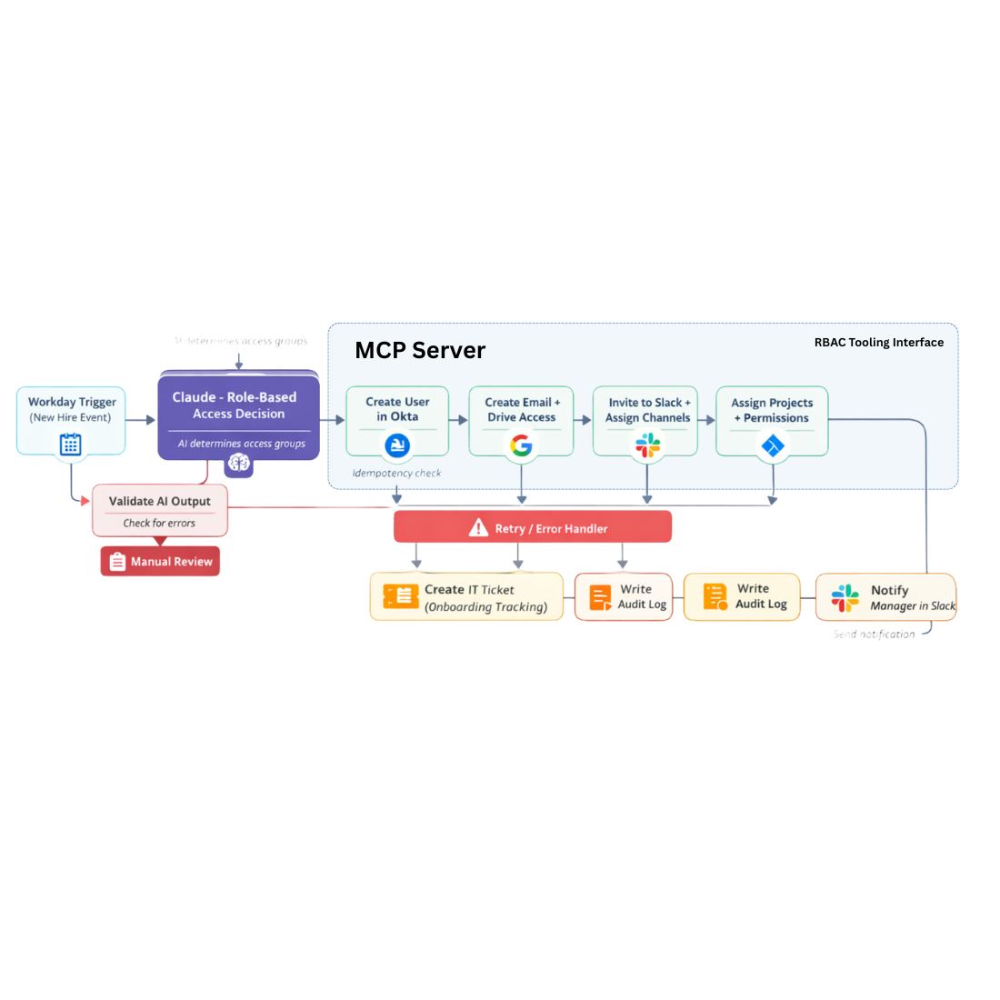
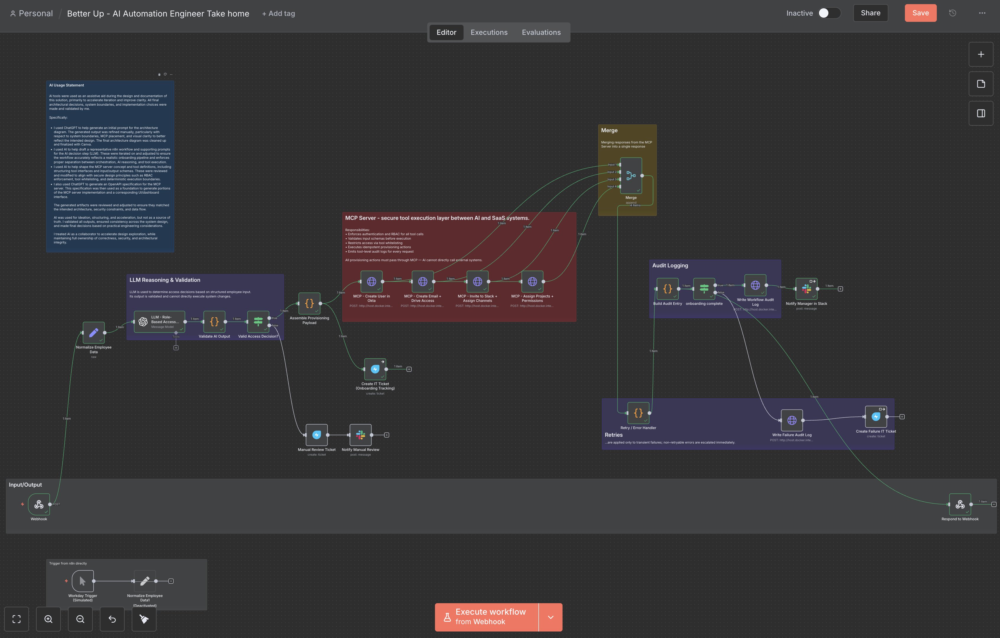
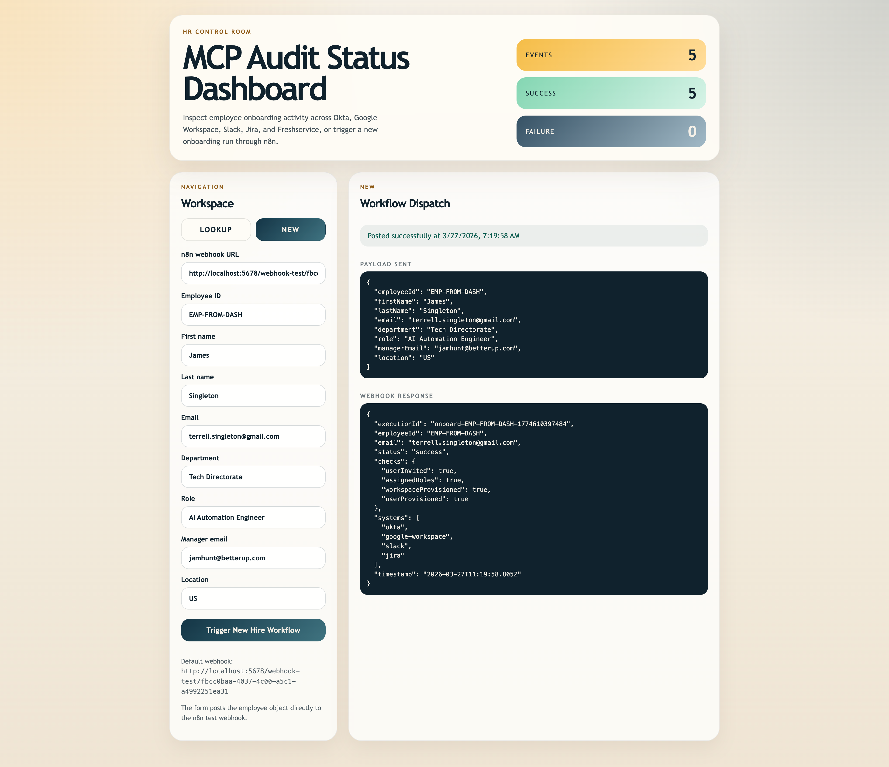

# HeliosHR MCP Demo

This repo is a small end-to-end onboarding demo built around an MCP-style backend.

It has two main parts:

- a Firebase Functions TypeScript backend that exposes onboarding tools, audit endpoints, and workflow orchestration
- a minimal React/Vite HR dashboard that can look up audit logs and trigger a new-hire webhook flow

### Executive Summary

I was asked to design an AI-powered employee onboarding system that integrates across multiple SaaS platforms like Okta, Google Workspace, Slack, and Jira. The goal was to move from a manual, fragmented onboarding process to a scalable, automated system that safely incorporates AI while maintaining governance, auditability, and reliability.

### Task

My responsibility was to design a system that not only automated onboarding end-to-end, but also demonstrated how AI could be used meaningfully in production, not just for generation, but as part of a controlled, secure workflow. This included defining the architecture, handling edge cases like failures and retries, enforcing access governance, and ensuring the system could scale across different roles and departments.

### Solution

I designed a layered architecture that separates orchestration, decision-making, and execution:

- I used an n8n-based workflow to orchestrate the onboarding process, including triggering from Workday, managing control flow, and handling retries, logging, and escalation.
- I incorporated an LLM as a decision engine to determine role-based access across systems. Its output is strictly validated before any execution occurs.
- I introduced an MCP server as a secure execution boundary between AI and external systems. All provisioning actions such as creating users or assigning permissions must pass through MCP, where authentication, RBAC, schema validation, idempotency, and audit logging are enforced.
- I implemented a fan-out / fan-in pattern where provisioning steps are aggregated using a merge pattern. A centralized handler evaluates overall success based on the combined results.
- I designed explicit handling for failures, including retry logic for transient errors and escalation paths that create IT tickets and notify stakeholders when manual intervention is required.
- I also defined an OpenAPI specification for the MCP server, which I used to generate consistent tool interfaces and accelerate both backend implementation and a supporting UI/dashboard.

Throughout the design, I focused on ensuring AI was used safely, constrained to decision-making, and could not directly execute system changes.

### Result

The result is a scalable, "production-ready onboarding system design" onboarding system that reduces manual effort while maintaining strong governance and observability. The design supports safe retries through idempotent operations, provides full auditability across both workflow and tool execution layers, and includes safeguards like validation and manual review paths.

Beyond the specific use case, the architecture is reusable and extensible. New tools or workflows can be added through the MCP layer without changing the core orchestration. Overall, the system demonstrates how AI can be integrated into enterprise automation in a way that is both powerful and controlled. 

The system is designed so that AI can recommend actions, but all execution is deterministic, validated, and governed through MCP.



## Technical Writeup
### Design Decisions

This system separates orchestration (n8n), decision-making (LLM), and execution (MCP) to ensure that AI is used for reasoning but cannot directly execute system changes. This reduces risk while maintaining flexibility.

The MCP server was introduced as a secure boundary to enforce RBAC, schema validation, idempotency, and audit logging across all provisioning actions.

#### Failures, Retries, and Edge Cases

Retries should be handled for transient failures (e.g., rate limits, network issues) using exponential backoff. Each provisioning step is idempotent, allowing safe re-execution of the workflow without duplicating resources.

Edge cases such as partial provisioning, invalid AI output, or missing data are handled through validation and escalation paths that create IT tickets and notify stakeholders.

#### Access Governance and Auditability

All provisioning actions are executed through the MCP server, which enforces RBAC and tool-level authorization. Audit logs are captured at both the tool level (within MCP) and workflow level (within n8n), ensuring full traceability.

#### Assumptions
- Workday provides a reliable onboarding trigger (I also implemented a dashboard to trigger n8n)
- SaaS systems expose APIs for provisioning
- Role-based access patterns exist and can be mapped
- AI output can be constrained and validated before execution

## Prototype


[View Workflow JSON](public/n8n-workflow.json)

## Repo Layout

```text
.
├── functions/                  Firebase Functions backend
│   ├── src/
│   │   ├── core/               MCP server execution logic
│   │   ├── infrastructure/     In-memory audit and execution stores
│   │   ├── tools/              Okta, Google, Slack, Jira, Freshservice tools
│   │   ├── workflows/          Example orchestration flow
│   │   ├── index.ts            HTTP entrypoint for mcpApi
│   │   ├── server.ts           MCP server factory
│   │   └── types.ts            Shared backend types
│   ├── package.json
│   └── tsconfig.json
├── src/                        React dashboard
│   ├── App.jsx
│   ├── main.jsx
│   └── styles.css
├── index.html                  Vite entrypoint
├── package.json                Frontend package config
├── vite.config.js
├── firebase.json               Hosting + functions config
├── mcp-openai.yaml             OpenAPI contract for the MCP server
├── mcp-openai.postman_collection.json
├── mcp-openai.postman_v2_collection.json
└── .env.postman.local          Local Postman environment values
```

## Backend

The Firebase function is exposed as `mcpApi` in [`functions/src/index.ts`](/Users/terrelltrapperkeepersingleton/vscode/better-up-take-home/functions/src/index.ts).

Key backend behavior:

- tool execution goes through [`functions/src/core/MCPServer.ts`](/Users/terrelltrapperkeepersingleton/vscode/better-up-take-home/functions/src/core/MCPServer.ts)
- retries are handled in [`functions/src/core/withRetry.ts`](/Users/terrelltrapperkeepersingleton/vscode/better-up-take-home/functions/src/core/withRetry.ts)
- idempotency is handled in [`functions/src/core/idempotency.ts`](/Users/terrelltrapperkeepersingleton/vscode/better-up-take-home/functions/src/core/idempotency.ts)
- tool-level audit logs are written through [`functions/src/core/writeToolAuditLog.ts`](/Users/terrelltrapperkeepersingleton/vscode/better-up-take-home/functions/src/core/writeToolAuditLog.ts)
- audit entries are stored in-memory through [`functions/src/infrastructure/ConsoleAuditLogger.ts`](/Users/terrelltrapperkeepersingleton/vscode/better-up-take-home/functions/src/infrastructure/ConsoleAuditLogger.ts)

Implemented API areas:

- `GET /health`
- `GET /audit/tool-invocations`
- `POST /audit/logs`
- `POST /tools/create_okta_user`
- `POST /tools/provision_google_workspace`
- `POST /tools/invite_slack_user`
- `POST /tools/assign_jira_permissions`
- `POST /tools/create_freshservice_ticket`
- `POST /workflows/provision_onboarding`

The OpenAPI contract lives in [`mcp-openai.yaml`](/Users/terrelltrapperkeepersingleton/vscode/better-up-take-home/mcp-openai.yaml).

## Frontend

The React dashboard lives in [`src/App.jsx`](/Users/terrelltrapperkeepersingleton/vscode/better-up-take-home/src/App.jsx).

It currently supports two left-sidebar modes:

- `Lookup`: fetch audit log entries by employee ID from the MCP backend 
- `New`: send a new-hire payload to the n8n test webhook and show the response 


Default targets in the UI:

- MCP API: `http://127.0.0.1:5001/betterup-hr-mcp/us-central1/mcpApi`
- n8n webhook: `http://localhost:5678/webhook-test/fbcc0baa-4037-4c00-a5c1-a4992251ea31`

## Local Development

Install frontend dependencies:

```bash
npm install
```

Run the React app:

```bash
npm run dev
```

Install backend dependencies:

```bash
cd functions
npm install
```

Build the Firebase Functions project:

```bash
npm run build
```

Run the Firebase Functions emulator:

```bash
npm run serve
```

The local MCP emulator base URL is:

```text
http://127.0.0.1:5001/betterup-hr-mcp/us-central1/mcpApi
```

## Audit Log Ingest Example

`POST /audit/logs` accepts workflow-level audit entries directly. For example:

```json
{
  "executionId": "onboard-EMP-10234-1774558983194",
  "employeeId": "EMP-10234",
  "email": "jordan.lee@helioshr.com",
  "status": "success",
  "checks": {
    "userInvited": true,
    "assignedRoles": true,
    "workspaceProvisioned": true,
    "userProvisioned": true
  },
  "systems": ["okta", "google-workspace", "slack", "jira"],
  "timestamp": "2026-03-26T21:03:03.324Z"
}
```

That payload is stored as a workflow audit entry and shows up in the audit lookup flow.

## Testing Assets

Available test assets:

- [`mcp-openai.yaml`](/Users/terrelltrapperkeepersingleton/vscode/better-up-take-home/mcp-openai.yaml)
- [`mcp-openai.postman_collection.json`](/Users/terrelltrapperkeepersingleton/vscode/better-up-take-home/mcp-openai.postman_collection.json)
- [`mcp-openai.postman_v2_collection.json`](/Users/terrelltrapperkeepersingleton/vscode/better-up-take-home/mcp-openai.postman_v2_collection.json)
- [`.env.postman.local`](/Users/terrelltrapperkeepersingleton/vscode/better-up-take-home/.env.postman.local)

If the VS Code Postman extension rejects the collection files, importing the OpenAPI spec is the safer path in this repo.

### AI Usage Statement

AI tools were used as an assistive aid during the design and documentation of this solution, primarily to accelerate iteration and improve clarity. All final architectural decisions, system boundaries, and implementation choices were made and validated by me.

Specifically:

* I used ChatGPT to help generate an initial prompt for the architecture diagram. The generated output was refined manually, particularly with respect to system boundaries, MCP placement, and visual clarity to better reflect the intended design. The final architecture diagram was cleaned up and finalized with Canva.
* I used AI to help draft a representative n8n workflow and supporting prompts for the AI decision step (LLM). These were iterated on and adjusted to ensure the workflow accurately reflects a realistic onboarding pipeline and enforces proper separation between orchestration, AI reasoning, and tool execution.
* I used AI to help shape the MCP server concept and tool definitions, including structuring tool interfaces and input/output schemas. These were reviewed and modified to align with secure design principles such as RBAC enforcement, tool whitelisting, and deterministic execution boundaries.
* I also used ChatGPT to generate an OpenAPI specification for the MCP server. This specification was then used as a foundation to generate portions of the MCP server implementation and a corresponding UI/dashboard interface. 

The generated artifacts were reviewed and adjusted to ensure they matched the intended architecture, security constraints, and data flow.

AI was used for ideation, structuring, and acceleration, but not as a source of truth. I validated all outputs, ensured consistency across the system design, and made final decisions based on practical engineering considerations.

I treated AI as a collaborator to accelerate design exploration, while maintaining full ownership of correctness, security, and architectural integrity & consistency.

### What I Would Build Next
- An actual auth policy engine to validate AI decisions against formal access rules
- Add metrics to the dashboard for onboarding latency and failure rates
- Template-based onboarding profiles by role and department
- Deeper integration with identity providers for auth (Okta SCIM, SAML flows)
- Separate logger workflow for orchestrator?
